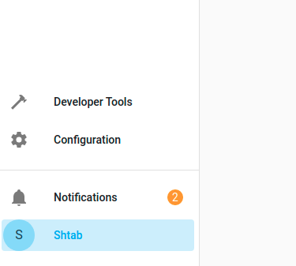
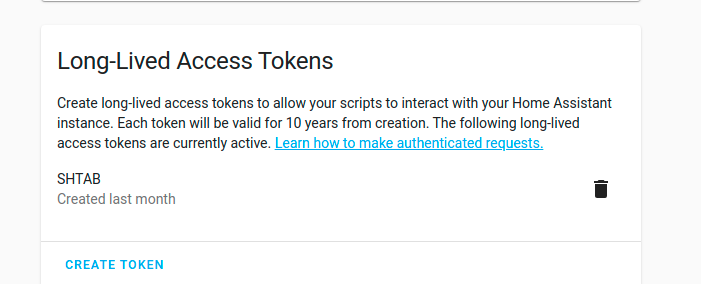

# Illumination Automation

With Illumination Automation you will be able to control how much light your plants get. To use it you need:

- Phytolamp
- Smart Plug
- Illumination Sensor

> Smart Plug and Illumination Sensor must be added to Home Assistant

## Installation

Clone the repository:
```bash
git clone https://github.com/airalab/robonomics-smarthome.git
```

## Configuration

You need Home Assistant access token. To get it open your `profile` in the lower left corner:



In the end of the page find `Long-Lived Access Tokens` and press `create token`. Save it somewhere, you will not be able to see it again.



After you got token, you need to fill `illumination_config.yaml` file:
```bash
nano robonomics-smarthome/python_scripts/automations/illumination/illumination_config.yaml
```
The template you can find in the `illumination_config_template.yaml`:
```yaml
access_token: 
dli: 17000000
lamp_coefficient: 12.9
light_socket_id: 
sensor_id: 
```
Where `access_token` is your token from Home Assistant, `dli` is daily rate of micromoles, `lamp_coefficient` is a coefficient to convert lux to micromoles/m^2*sec (it depends on the type of your lamp, 12.9 is for lamps with blue-red spectrum). `light_socket_id` and `sensor_id` are entity ids of your smart plug and illumination sensor, you can find it in Home Assistant.

## Run

Firstly, build the docker image:
```bash
cd robonomics-smarthome/python_scripts/automations/illumination
docker build -t illumination-automation .
```

Then run the container:
```bash
docker run -t -d --restart always --name illumination-automation -v illumination-automation:/data --network host illumination-automation
```

You can see logs with:
```bash
docker logs illumination-automation -f
```