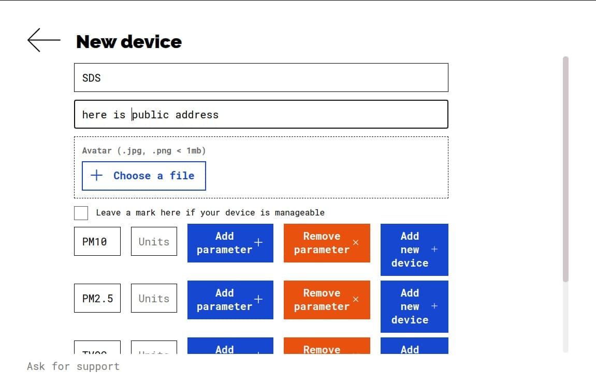

# Connect SDS particular sensor to robonomics

## Requirements

- particle sensor SDS011 Nodemcu V3 connected with [this instruction](https://wiki.robonomics.network/docs/en/connect-sensor-to-robonomics/)

## Installation

You need to get access to the USB port adding your user to `dialout` group (it works for ubuntu, but the name of the group may be different on other OS).
For ubuntu:
```bash
sudo usermod -a -G dialout $USER
```
For arch:
```bash
sudo usermod -a -G uucp $USER
```
Then logout and login or restart the computer.

And pull docker image:
```bash
docker pull loskp/sds_robonomics
```

## Run

Connect ESP via USB to the computer and run docker container:
```bash
docker run  -t --device=/dev/ttyUSB0 -v python_scripts:/python_scripts -e USER_SEED='<user_seed>' --name sds_robonomics loskp/sds_robonomics
```
> `/dev/ttyUSB0` is USB port name, it may be different (`/dev/ttyUSB1`, `/dev/ttyACM0`, `/dev/ttyAMA0`).
> `<user_seed>` is raw or mnemonic seed of your robonomics account (instruction of how to create account is [here](https://wiki.robonomics.network/docs/en/create-account-in-dapp/)).

If you run container for the first time, account for sensor will be automatically created and you will see public address in terminal. To start publish encrypted data to Robonomics you need XRT in you sensor account and `launch` transaction to it. With launch transactions you can stop and start sending data to Robonomics.

You will be able to see your encrypted data in sensors's account datalog in [subscan](https://robonomics.subscan.io/). You can decrypt it with `decrypt.py` script. Exec the container:
```bash
docker exec -ti sds_robonomics bash
```
And run the script:
```bash
python3 python_scripts/decrypt.py <encrypted_data>
```
## Install & run smarthome app
```
mkdir smarthome && cd smarthome
git clone https://github.com/tubleronchik/robonomics_smarthome
cd robonomics_smarthome/config
```
Create file `congig.py` using the template `config_template.py` amd add there public addresses of your devices (currently temperature, and humidity sensor, vaccum and lightbulb. All other devices can be added via "Add device" option in app).

You can run app using docker docker:
```
cd ..
docker build --tag app .  
docker run -p 8000:8000 app   
```
Or like python app:
```
cd ..
pip3 install -r requirements.txt
uvicorn app:app
```
In another terminal:
```
cd <path to smarthome directory>
git clone https://github.com/IvanGlebov/robonomics-smarthome-frontend
cd robonomics-smarthome-frontend
```
Create file ``.env`` to the directory with public addresses of your sensors:
```
ID_AQUARA=
ID_VACUUM=
ID_LAMP=
```
### Building
It may take some time.
```
yarn install
yarn build
```
All build files will be located inside `/dist` folder.
### Dev deployment
```
yarn develop
```
You can find server on `http://localhost:8080`

### Add SDS device

Press `Add New Device` button in the end of the page and write name and device id. Device id is the public address of the sensor. Then add parameters via `Add Parameter` button, parameters must be the same as from config file ('PM10', 'PM2.5', 'CO2', 'TVOC', 'Temperature', 'Humidity'). And press `Add New Device` button.

 