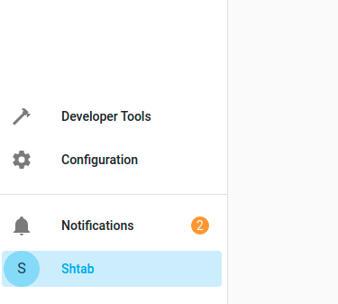

# Connect Vacuum Cleaner to Robonomics

## Connect to Home Assistant

You need your vacuum to be connected to Mi Home app. If you haven't done this yet press `+` button on the top right corner, find your vacuum (it must be in connecting mode via a long press of the power button) and follow instructions in the app. For more details look at the user manual of your vacuum.

Open Home Assistant web page with this address:
```
http://<raspberry_address>:8123
```

Go to `Integrations` tab, press `Add integration` and choose `Xiaomi Miio`:


Then fill your username (or phone) and password from Mi Home account and choose your country server:


Press `Submit` and choose your Vacuum (Robot vacuum in this example):


Then we need to setup action to control Vacuum through Robonomics. For that open a configuration file on your raspberry pi:

```bash
nano /srv/homeassistant/python_scripts/config.config
```

And add information about vacuum to the end of the file:

```
[vacuum]
IDS = ['vacuum.robot_vacuum']
SEED = word word word word
```
Where `vacuum.robot_vacuum` is Entity ID of the vacuum.

After you fill the configuration file you need to get access token from Home Assistant if you don't have it yet. For that open your `profile` in the lower left corner:



In the end of the page find `Long-Lived Access Tokens` and press `create token`. Save it somewhere, you will not be able to see it again.


Now run `create_config.py` script with your token:

```bash
cd /srv/homeassistant
python3 python_scripts/create_config.py --token <access_token>
```

And restart Home Assistant:
```bash
systemctl restart home-sistant@homeassistant.service
```

Now you can create datalog in your user account to command robot to Start Cleaning, to Pause or to Return to Base. The message must be encrypted, you can encrypt message with [encrypt.py](python_scripts/encrypt.py) script:
```bash
cd /srv/homeassistant/python_scripts
source /srv/homeassistant/bin/activate
python3 encrypt.py <message>
```
Message format:
- to pause: `{"agent": "vacuum_start"}`
- to pause: `{"agent": "vacuum_pause"}`
- to return to base: `{"agent": "vacuum_return_to_base"}`

> `vacuum` in `vacuum_start` and other commands is the name of you device from config file.
